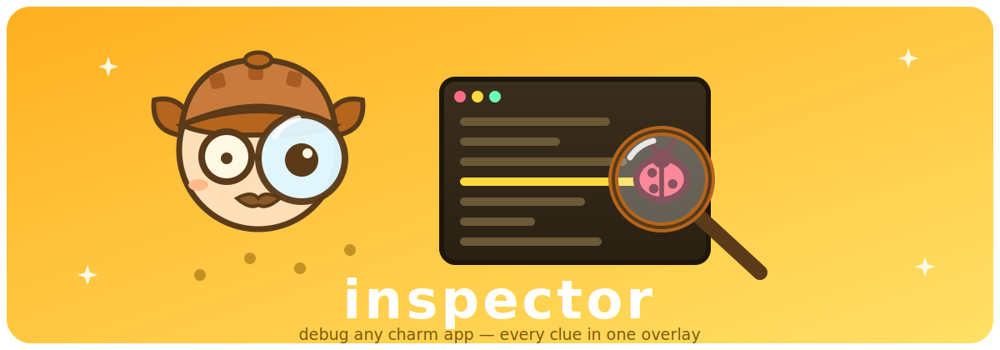

# inspector



[](https://github.com/jarvisfriends/inspector/actions/workflows/ci.yml)
[](https://scorecard.dev/viewer/?uri=github.com/jarvisfriends/inspector)
[](https://pkg.go.dev/github.com/jarvisfriends/inspector)

Runtime debug inspector for any [Charm](https://charm.land) Bubble Tea v2
app.

Tabs: live message log with deduplication, runtime log streaming, Go runtime
stats (GC, goroutines, memory), terminal diagnostics, link-rate metrics via
pluggable providers (`MetricsProvider`), feature gates, and an accessibility
panel that previews every registered tint against CVD-simulated contrast.

## Use as a library

The inspector is a plain `tea.Model` (`inspector.New()`); hosts render it as
an overlay and forward keys/mouse/resize. It is host-agnostic:

- Theme: implements `styles.ColorAware` (snap's shared style contract) so a
  host can hand it the live palette pointer.
- Applying themes: the accessibility tab emits `inspector.ApplyThemeMsg{ID}`;
  the host translates it into its own theme plumbing.
- Extra tabs: register `Provider`s (see `provider.go`) for app-specific
  metrics.

## Run standalone

```sh
go run ./cmd/inspector
```

Fills the terminal with the inspector itself: tab/←/→ or digits switch tabs,
`i`/`w`/`e` fire test notifications, `q` quits.

## Demo

The tape in `cmd/inspector/demo.tape` cycles through all inspector tab
groups and keyboard tab switching.


## Development

`gofmt`, `go vet`, `golangci-lint run`, `go test -race ./...` — same bar as
the sibling repos.
